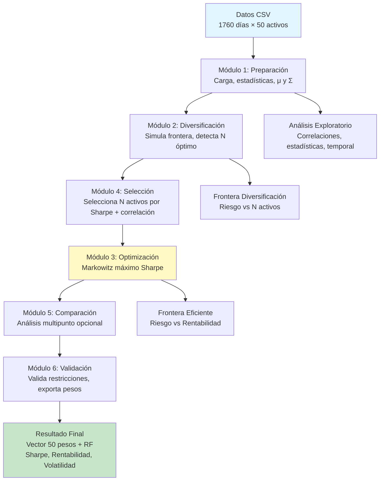

# RESUMEN EJECUTIVO: OPTIMIZACIÓN DE CARTERAS

## DIAGRAMA DE FLUJO DEL PROYECTO

## PROCESO RESUMIDO

**1. PREPARACIÓN (1datos.py)**: Carga CSV, calcula estadísticas anualizadas (μ, Σ), analiza correlaciones y comportamiento temporal. **Resultado**: Datos limpios y estadísticas preparadas.

**2. DIVERSIFICACIÓN (2equiponderada_diversificacion.py)**: Simula carteras equiponderadas variando N activos, descompone riesgo (específico vs sistemático), detecta N óptimo donde beneficios marginales se reducen. **Resultado**: Número óptimo de activos (típicamente 15-25).

**3. SELECCIÓN (4seleccion_activos.py)**: Selecciona N activos balanceando Sharpe Ratio alto y baja correlación mediante score combinado. Filtra retornos a activos seleccionados. **Resultado**: Subconjunto óptimo de N activos.

**4. OPTIMIZACIÓN (3markowitz.py)**: Optimiza cartera con CVXPY maximizando Sharpe Ratio `(μp - rf)/σp` sujeto a restricciones (long-only, suma=1, RF≤10%). Reconstruye vector de 50 posiciones. **Resultado**: Pesos óptimos y métricas de cartera.

**5. COMPARACIÓN (5analisis_multipunto.py, opcional)**: Detecta múltiples puntos de interés en frontera, optimiza para cada N, compara resultados. **Resultado**: Comparativa de estrategias.

**6. VALIDACIÓN (validacion.py)**: Valida restricciones, calcula métricas finales (Sharpe, Herfindahl, concentración), exporta pesos a CSV. **Resultado**: Cartera validada y lista para entrega.

## FUNCIONES CLAVE

- **`cargar_retornos()`**: Carga y valida datos
- **`PreparadorDatos`**: Calcula μ y Σ anualizados
- **`simular_frontera_diversificacion()`**: Simula efecto diversificación
- **`detectar_frontera_optima()`**: Identifica N óptimo
- **`seleccionar_activos_por_sharpe_decorrelacion()`**: Selecciona activos
- **`optimizar_sharpe_maximo()`**: Maximiza Sharpe Ratio
- **`optimizar_cartera_con_seleccion()`**: Pipeline completo
- **`validar_cartera()`**: Valida restricciones

## RESULTADOS FINALES

**Output**: Vector de 50 pesos (uno por activo) + peso en renta fija (≤10%), con métricas: Sharpe Ratio anualizado, rentabilidad esperada, volatilidad, índice de Herfindahl (concentración), número de activos significativos. **Teoría aplicada**: Markowitz (1952), Sharpe Ratio, diversificación, optimización convexa.
