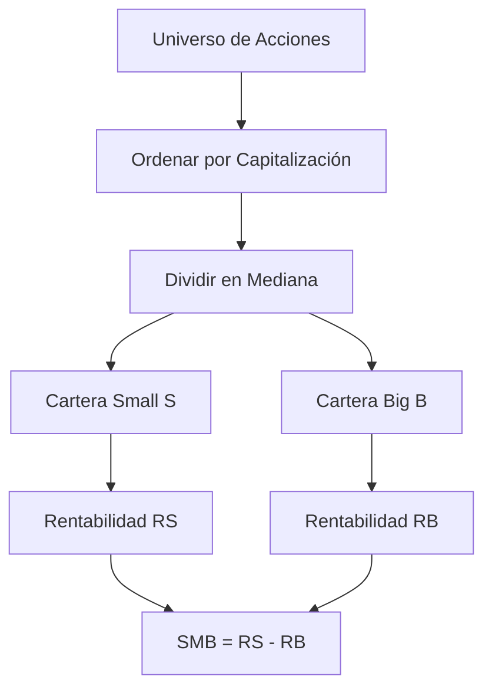
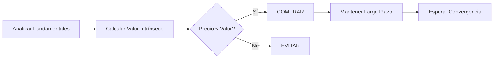
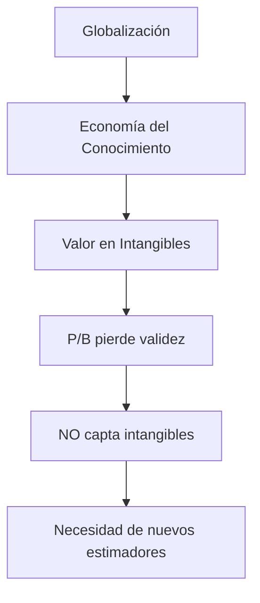
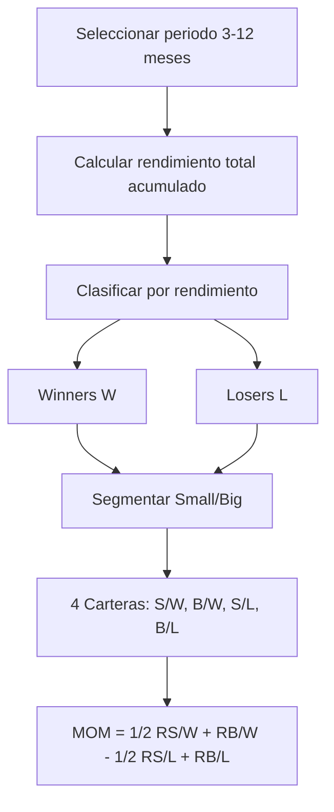
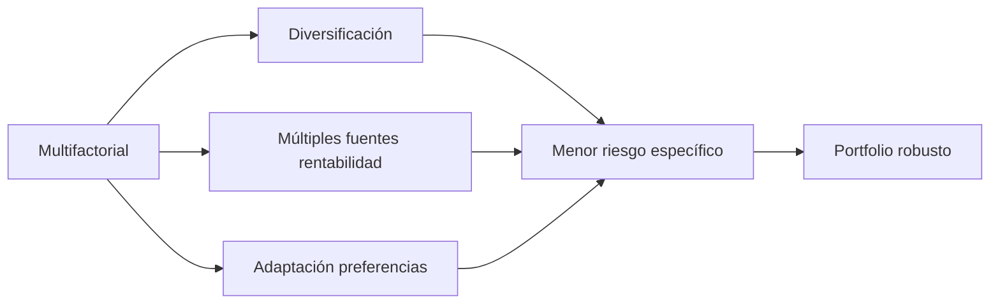
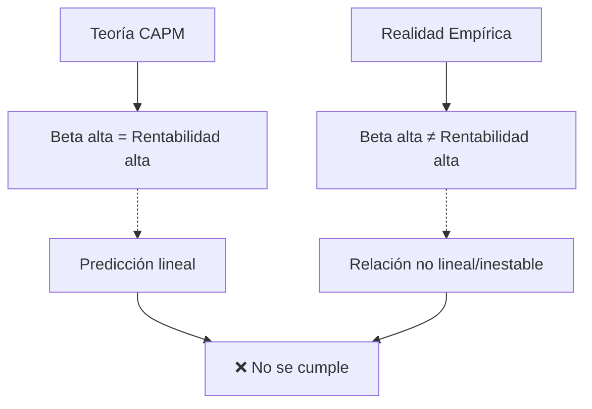
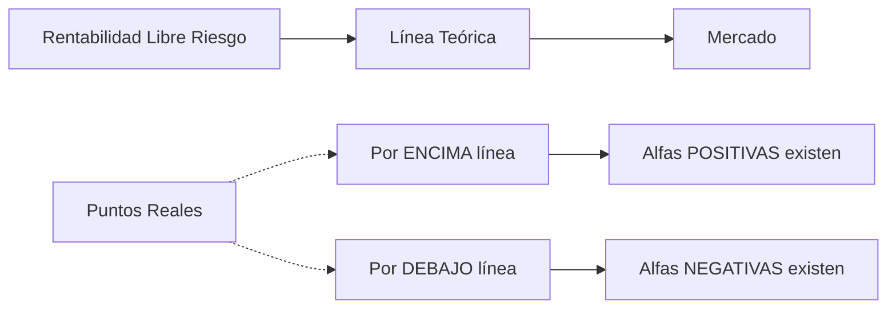
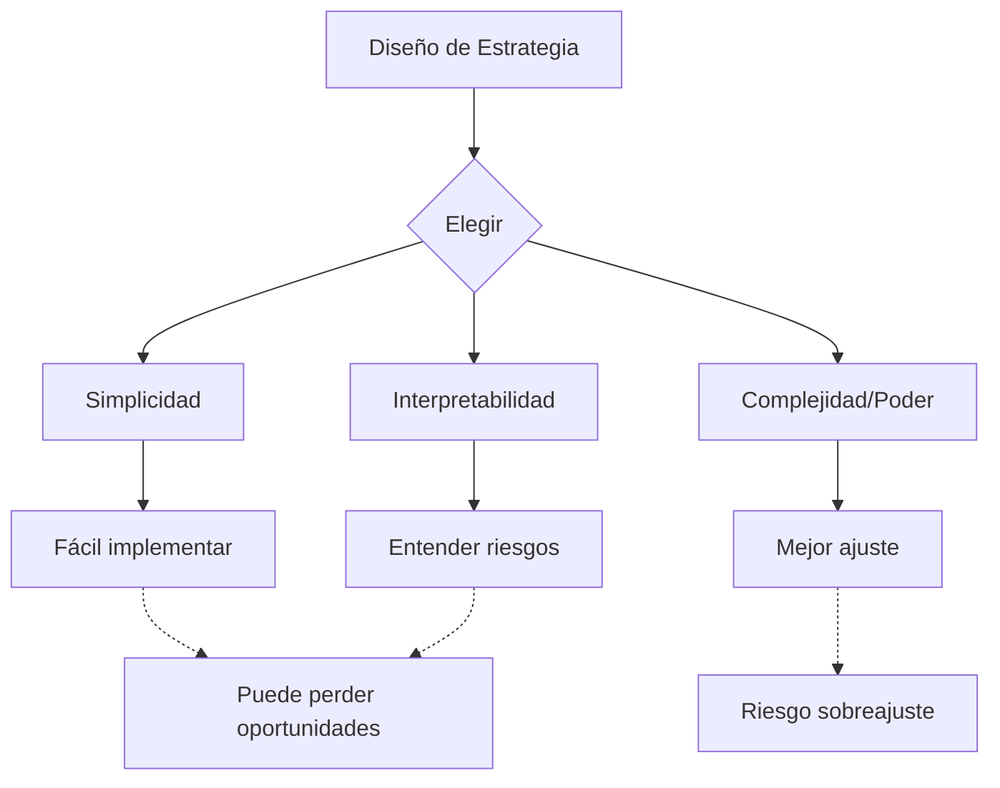

# Análisis Ejecutivo: Smart Betas y APT - Factores de Inversión

## 📋 Resumen Ejecutivo

Este documento integra dos análisis complementarios sobre teoría de precios de activos: el modelo APT (Arbitrage Pricing Theory) con factores Smart Beta y evidencia empírica sobre las limitaciones del CAPM tradicional. Los documentos revelan tanto las oportunidades de los modelos multifactoriales como los problemas fundamentales de estabilidad de las betas.

---

## 1️⃣ CUESTIONAMIENTO DEL MODELO DE MARKOWITZ

### Hipótesis Originales vs. Realidad

| Hipótesis de Markowitz | Realidad del Mercado |
|------------------------|----------------------|
| **Horizonte de un periodo** | Necesidad de rebalanceo óptimo continuo |
| **Expectativas homogéneas** | Cada inversor tiene sesgos cognitivos propios |
| **Sin impuestos ni costes** | Fiscalidad diferenciada y costes dependientes de liquidez |
| **Inversores precio-aceptantes** | Concentración de capital puede provocar anomalías |
| **Información gratuita y accesible** | Problemas de asimetría de información |

### 🎯 Nuevas Primas por Riesgo

La utilidad tradicional basada solo en rentabilidad-riesgo es insuficiente porque:

- **Percepción asimétrica del riesgo**: Los inversores sufren más por pérdidas que disfrutan por ganancias
- **Prima por curtosis** (Ang et al., 2006): Compensación por colas pesadas
- **Prima por momentum** (Jegadeesh & Titman, 1993): Los precios tienen memoria
- **Prima por asimetría** (Mitton & Vorkink, 2007): Preferencia por skewness
- **Co-skewness y co-kurtosis** (Harvey & Siddique, 2000): Momentos superiores correlacionados

---

## 2️⃣ TEORÍA APT: MODELO MULTIFACTORIAL

### Fórmula General

```
E(ri) = rf + βi,1·E(f1) + βi,2·E(f2) + ... + βi,K·E(fK)
```

Donde:
- **βi,k**: Beta del activo i respecto al factor k
- **E(fk)**: Prima del factor de riesgo k
- **K**: Número de factores

### Ventajas del APT
✅ Los factores pueden tener interpretación económica  
✅ Mayor flexibilidad que CAPM  
✅ Captura múltiples fuentes de riesgo  

### ⚠️ Desafíos del APT
- No existe consenso sobre identidad y número de factores K
- Riesgo de multicolinealidad con muchos factores
- Problema de sobreajuste con machine learning
- Autocorrelación temporal de rendimientos
- Errores correlacionados entre activos (cross-sectional dependence)
- Inferencia estadística poco fiable con regresión "naive pooling"

### 🌳 La Jungla de los Factores

**Datos alarmantes**:
- **316 factores** identificados entre 1967-2016 (Harvey & Siddique, 2000)
- Tras evaluación rigurosa: **80-142 factores** potencialmente válidos
- Análisis de componentes principales identifica **máximo 5 factores** de riesgo real (Pelger, 2020)

**Efecto publicación**: La rentabilidad de factores se reduce **31% tras publicación** del artículo científico (Hu et al., 2014)

---

## 3️⃣ MODELO FAMA-FRENCH DE 3 FACTORES + MOMENTUM

### Ecuación Completa

```
E(ri) = rf + βi,MKT·E(rm-rf) + βi,SMB·E(SMB) + βi,HML·E(HML) + βi,MOM·E(MOM) + εi
```

---

## 📊 FACTOR 1: TAMAÑO (SMB - Small Minus Big)

### Definición y Construcción



**Fórmula**: `SMB = RS - RB`

### 📈 Evidencia Histórica

| Periodo | Hallazgo Principal | Autor |
|---------|-------------------|-------|
| **1936-1975** | Prima de tamaño significativa, especialmente en enero | Banz (1981) |
| **Pre-1980** | Confirmación del efecto tamaño robusto | Dimson et al. (2011) |
| **Post-1985** | **La prima desaparece prácticamente** | Fama & French (2012) |

### 💀 ¿La Muerte del Factor Tamaño?

**Cambios estructurales desde los 80s**:

1. **Globalización financiera**
   - Concentración del capital en institucionales
   - Preferencia por large caps líquidas

2. **Cambio tecnológico sesgado**
   - Empresas grandes necesitan IT para:
     - Gestionar diversificación internacional
     - Manejar cadenas globales de suministro
     - Explotar economías de red
   - Fortalecimiento de marcas globales
   - I+D intensivo para diferenciación

3. **Desventajas small caps**
   - Mayor volatilidad
   - Spreads más amplios
   - Menor liquidez
   - Mayores costes de transacción
   - Imposibilidad de alcanzar tamaño competitivo

4. **Crisis 2007**: Castigo desproporcionado a small caps

**Resultado**: Desaparición masiva de small caps

---

## 💎 FACTOR 2: VALOR (HML - High Minus Low)

### Estrategia de Inversión Valor



**Principios**:
- ✅ Estrategia largo plazo (comprar y mantener)
- ✅ Conocer valor intrínseco (real) del activo
- ✅ Ir contra la opinión del mercado
- ✅ Aprovechar ineficiencias temporales

### 📋 Benjamin Graham Screen

**Criterios de Selección**:

| Categoría | Criterios |
|-----------|-----------|
| **Valoración** | • P/E < 1/(Rendimiento AAA)<br>• P/E < 40% de media 5 años<br>• Precio < 2/3 valor contable<br>• Precio < 2/3 activo neto corriente |
| **Dividendos** | • Rendimiento > 2/3 rendimiento AAA |
| **Solvencia** | • Deuda/Capital < 1<br>• Activos corrientes > 2× Pasivos corrientes<br>• Deuda < 2× Activos netos corrientes |
| **Crecimiento** | • EPS últimos 10 años > 7%<br>• Máx. 2 años con ganancias negativas |

**Ejemplo Berkshire Hathaway**: Warren Buffett aplicó estos principios con extraordinario éxito

### 📊 Price-to-Book (P/B) Ratio

```
P/B = Capitalización / (Activo Total - Pasivo Total)
```

**Ventajas**:
- ✅ Valor de activos más estable que beneficios/dividendos
- ✅ Usar media de últimos 5 años
- ✅ Indica prima por riesgo y/o infravaloración

### 🔬 Evidencia de Anomalías Value/Growth

| Autor | Año | Hallazgo |
|-------|-----|----------|
| **Basu** | 1983 | Bajo P/E → Mayores retornos (desafía CAPM) |
| **Rosenberg et al.** | 1985 | Bajo P/B → Mayores retornos significativos |
| **Oppenheimer** | 1984 | Criterios Graham baten al mercado |
| **Lakonishok et al.** | 1994 | Acciones "baratas" → Retornos superiores ajustados por riesgo |
| **Fama & French** | 1992 | 100 carteras confirman: menor P/B → mayor rentabilidad |

### 🧠 Explicación Conductual

**Por qué funciona Value**:

1. **Extrapolación excesiva**
   - Inversores sobrestiman growth por rendimiento pasado
   - Asumen crecimiento insostenible

2. **Infravaloración sistemática**
   - Acciones value castigadas en exceso
   - No es mayor riesgo, es pesimismo excesivo

3. **Reversión lenta**
   - Growth decepciona expectativas optimistas
   - Value sorprende positivamente con expectativas bajas

### 💀 ¿La Muerte del Factor Valor?

**Cambio estructural hacia economía del conocimiento**:



**Problema**: P/B ya no identifica infravaloración, sino dificultad contable para valorar intangibles

**Solución**: Gonçalves & Leonard (2023) proponen medidas alternativas que incluyen activos intangibles

---

## 🚀 FACTOR 3: MOMENTUM (MOM)

### Definición y Evidencia

**Hallazgo clave** (Jegadeesh & Titman, 1993):

> Acciones con buen rendimiento en últimos 3-12 meses → Continúan superando en próximos 3-12 meses

**Datos**:
- Mercado USA 1965-1989
- Estrategia long winners / short losers
- Rendimientos anormalmente altos
- Rebalanceo cada 6 meses (corto plazo)

### 📐 Construcción del Factor MOM



### 🧠 Explicación desde Finanzas Conductuales

**Sesgos cognitivos que explican momentum**:

1. **Comportamiento gregario**
   - Presión social → Imitación de la mayoría
   - Creencia: "la mayoría no puede equivocarse"

2. **Sesgo de confirmación**
   - Buscar evidencia que confirme creencias
   - Provoca reacciones exageradas corto plazo

3. **Representatividad**
   - "Lo de hoy continuará mañana"
   - Genera exceso de confianza

### ⚠️ Tres Problemas del Momentum

| Problema | Descripción |
|----------|-------------|
| **Escalabilidad** | Mercados pequeños sin suficientes activos |
| **Mayor volatilidad** | Seleccionar más rentables = Asumir más riesgo |
| **Altos costes** | Rebalanceos semestrales frecuentes |

### 💀 ¿La Muerte del Momentum?

**Momentum Crashes** (Daniel & Moskowitz, 2016):

Los crashes son **parcialmente predecibles** en momentos de:
- ⚡ Caída brusca de mercados
- 📊 Alta volatilidad
- 🔄 Rebote tras crisis

**Solución**: Barroso & Santa-Clara (2015) proponen **momentum ajustado por volatilidad**

---

## 🎯 ESTRATEGIA DE INVERSIÓN MULTIFACTORIAL

### Ventajas



**Beneficios**:
- ✅ Mayor nivel de diversificación
- ✅ Identificar distintas fuentes de rentabilidad
- ✅ Carteras adaptadas a preferencias del inversor
- ✅ Reducción de dependencia de un solo factor

---

## 📉 EVIDENCIA EMPÍRICA: LIMITACIONES DE BETA

### Problema 1: Inestabilidad de Beta Disney

**Variación según índice de mercado** (1993-2007):

| Índice | Beta Estimada | Interpretación |
|--------|---------------|----------------|
| S&P 500 | β₁ | Referencia |
| Dow Jones | β₂ | **Diferente** |
| NYSE Composite | β₃ | **Diferente** |

**Conclusión**: La beta cambia según el índice de referencia elegido

**Variación según periodicidad temporal**:

| Frecuencia | Beta | Problema |
|------------|------|----------|
| Diaria | βd | Diferente |
| Semanal | βw | Diferente |
| Mensual | βm | Diferente |

**Conclusión**: La beta es sensible a la frecuencia de datos

### Problema 2: Relación Riesgo-Rentabilidad Inestable

**Años 60**: Relación positiva clara
```
Alta Beta → Alta Rentabilidad ✓
```

**1969-1974**: Relación se rompe
```
Fondos Crecimiento: Alta Beta → BAJA Rentabilidad ✗
```

**1974-1988**: Relación se invierte
```
Fondos Mixtos (beta baja) → Mejor rentabilidad
```

### 📊 Visualización del Problema



### Problema 3: Existencia de Alfas

**Teoría CAPM**: Todos los fondos en la línea de mercado (alfa = 0)

**Evidencia real**:


**Conclusión**: Los gestores pueden generar valor (o destruirlo)

### Problema 4: Relación Negativa Corto Plazo

**Estudio 271 fondos (1981-1991)**:

> En periodos cortos, rentabilidad y riesgo pueden tener **relación NEGATIVA**

```
Mayor riesgo → MENOR rentabilidad (corto plazo)
```

Esto contradice completamente el CAPM

---

## 🎓 CONCLUSIONES INTEGRADAS

### 1. Crisis del CAPM Tradicional

| Aspecto | Teoría | Realidad |
|---------|--------|----------|
| **Estabilidad Beta** | Constante | Variable según índice/periodo |
| **Riesgo-Rentabilidad** | Lineal positiva | No lineal, puede ser negativa |
| **Alfas** | No existen | Existen y son significativos |
| **Factor único** | Suficiente | Insuficiente |

### 2. Necesidad de Modelos Multifactoriales

**Evolución**:
```
CAPM (1 factor) → Fama-French 3F → Fama-French 5F → Cientos de factores
```

**Reto**: Equilibrio entre:
- Captura de factores relevantes
- Evitar sobreajuste
- Mantener interpretabilidad económica

### 3. Estado Actual de los Factores

| Factor | Estado | Causa |
|--------|--------|-------|
| **SMB (Tamaño)** | ⚰️ Moribundo | Cambios estructurales, globalización |
| **HML (Valor)** | ⚠️ Transformándose | Economía del conocimiento, intangibles |
| **MOM (Momentum)** | 🔄 Adaptándose | Crashes predecibles, ajuste por volatilidad |

### 4. Factores de Éxito Futuros

**Requisitos para factores robustos**:
1. ✅ Fundamento económico sólido
2. ✅ Persistencia temporal
3. ✅ Validez cross-sectional
4. ✅ Adaptación a cambios estructurales
5. ✅ Implementabilidad (costes razonables)

### 5. Trade-off Fundamental



### 6. Implicaciones Prácticas

**Para Inversores**:
- 🎯 No confiar ciegamente en una sola beta
- 📊 Usar múltiples factores complementarios
- 🔄 Rebalancear según cambios estructurales
- 💰 Considerar costes de implementación
- 🧠 Entender sesgos conductuales propios

**Para Gestores**:
- 🔬 Validar factores en múltiples periodos
- 🌍 Considerar cambios macroeconómicos
- 📈 Ajustar por volatilidad en momentum
- 💡 Incorporar activos intangibles en valor
- ⚖️ Balance entre factores según ciclo

---

## 📚 Referencias Clave

**Trabajos Fundamentales**:
- Fama & French (1992, 1996, 2012): Modelos multifactoriales
- Jegadeesh & Titman (1993): Momentum
- Banz (1981): Efecto tamaño
- Lakonishok et al. (1994): Value premium
- Harvey & Siddique (2000): Jungla de factores

**Evidencia Reciente**:
- Daniel & Moskowitz (2016): Momentum crashes
- Gonçalves & Leonard (2023): Nuevas medidas valor
- Pelger (2020): Componentes principales
- Hu et al. (2014): Efecto publicación

---

## 💡 Mensaje Final

Los modelos factoriales son **herramientas poderosas pero imperfectas**. Su efectividad depende de:

1. **Adaptación continua** a cambios estructurales
2. **Rigor estadístico** en selección de factores
3. **Fundamento económico** sólido
4. **Gestión de costes** de implementación
5. **Conciencia de limitaciones** y sesgos

> "No existe bala de plata en inversión. Los factores son útiles pero requieren entendimiento profundo, adaptación constante y humildad ante la complejidad del mercado."

---

**Fecha**: Enero 2026  
**Fuente**: Análisis integrado APT_MIAX.pdf + CUESTI_1.PDF  
**Autores originales**: Alfonso Santos, Fernando Úbeda (UAM)